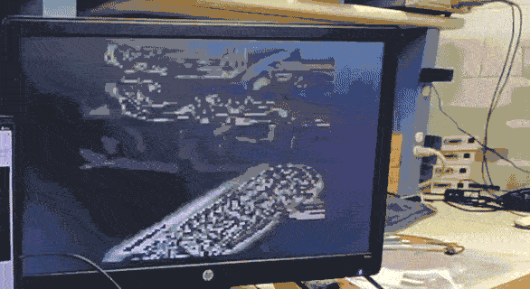

# FPGA Near-infrared Vein Imaging

## About

This is a VHDL implementation of [Near Infrared Illumination Optimization for Vein Detection: Hardware and Software Approaches](https://www.mdpi.com/2076-3417/12/21/11173).

<figure>
  
  <figcaption>Live demo (PNG)</figcaption>
</figure>

<figure>
  
  <figcaption>Live demo (GIF)</figcaption>
</figure>

<figure>
  
  <figcaption>Python implementation of quantized algorithm, illustrated with output from each stage.</figcaption>
</figure>

<figure>
  
  <figcaption>Picture of system. MCU development board is only used as a 3.3V power source.</figcaption>
</figure>

## Bill of Materials

- [Cmod A7-35T](https://digilent.com/shop/cmod-a7-35t-breadboardable-artix-7-fpga-module/)
- [HiLetgo OV7670 640x480 0.3Mega 300KP VGA CMOS Camera Module](https://www.amazon.com/dp/B07S66Y3ZQ)
- [850nm Infrared COB Module Light Emitter Diode Component (1050mA,4-5V,140deg,42mil chip,Square Bracket)](https://www.amazon.com/dp/B0CC48J23S)
- [2.1mm 160 Degrees Lens 850nm IR filter M12](https://www.ebay.com/itm/145128062945)
- Pull-up resistors, jumper wires, power sources, VGA connectors and screens provided by lab thus not documented.

## Software

- Python 3.13.11, with packages installed specified by `requirements.txt`.
- VSCode 1.107.0.
- VSCode extension [Pylance](https://marketplace.visualstudio.com/items?itemName=ms-python.vscode-pylance), v2025.10.4. (Python language server)
- VSCode extension [Ruff](https://marketplace.visualstudio.com/items?itemName=charliermarsh.ruff), v2025.32.0. (Python formatter)
- VSCode extension [VHDL LS](https://marketplace.visualstudio.com/items?itemName=hbohlin.vhdl-ls), v0.7.0. (VHDL language server)
- VSCode extension [VHDL Formatter](https://marketplace.visualstudio.com/items?itemName=Vinrobot.vhdl-formatter), v1.0.5. (VHDL formatter)
- Vivado 2025.1. Assumed to be installed under `/opt/Xilinx/2025.1/` for VHDL LS, see `vhdl_ls.toml` for configuring otherwise.

## Project Structure

- `data/`: images as test input and for this readme.
- `python/notebooks/`: Jupyter notebooks during Python reproduction of reference algorithm and manual quantization.
- `python/scripts/calc-window-params.py`: Generates commands to send to the OV7670 camera module to select a certain output windows. Camera documentation unclear on this part.
- `python/scripts/image-view.py`: Visualizes binary image data.
- `python/Victor/`: Experiments with the reproduction of the CLAHE algorithm.
- `python/golden.py`: Golden quantized Python implementation of the whole processing flow. Strongly typed, VHDL project strictly follows this.
- `HDL/constraints/`: XDC constraint files.
- `HDL/VHDL/`: VHDL project:
  - global include: `constants.vhd`.
  - main system: all except `*_TB.vhd`, `*_tb.vhd`, `top.vhd`, `cam_test_pattern.vhd`, `cmt.vhd`.
  - `cam_test_pattern.vhd`: A fake camera module generating alternating vertical stripes on trigger, once used to test rest of system.
  - `cmt.vhd`: Instantiation of Xilinx Clock Management Tile for generating clocks for the whole system.
  - `top.vhd` + `cmt.vhd` + main system: Actual system.
  - `top_TB.vhd` + main system: Simulation of whole system.
  - `cam_vga.vhd`, `cam_vga_TB.vhd`: Camera image data interface test.
  - `cam_ov7670_ctrl_TB.vhd`, `cam_ov7670_ctrl.vhd`, `i2c_write_master.vhd`: Camera control interface test.
  - `CLAHE_controller_tb.vhd`, `CLAHE_controller.vhd`, `CLAHE_mappings.vhd`: CLAHE algorithm, mapping generation half, test.
  - `CLAHE_output_tb.vhd`, `CLAHE_output.vhd`: CLAHE algorithm, mapping application half, test.
  - `HESSIAN_CONV_C_TB.vhd`, `HESSIAN_conv_c.vhd`: Gaussian filtering along column direction test.
  - `HESSIAN_CONV_R_TB.vhd`, `HESSIAN_CONV_R.vhd`: Gaussian filtering along row direction test.
  - `hessian_grad_TB.vhd`, `hessian_grad_c.vhd`, `hessian_grad_r.vhd`, `hessian_grad_rr_cc.vhd`: Second order gradient along both row and column directions test.
  - `hessian_output_TB.vhd`, `hessian_output.vhd`: Eigenvalue calculation and final output module test.

## Instructions

1. Setup Python and install all required packages.
2. `python python/golden.py data/real.crop.00.png` to run golden Python implementation, generate testbench data and see visualizations of the algorithm
3. Create a Vivado project for the Cmod A7-35T board, add all `.vhd` and `.xdc` files, set `top.vhd` as top.
4. Simulations of the testbenches are likely not going to work out of the box due to file inclusion and data file path issues. Follow the hint of error messages.
5. Synthesize with strategy `Flow_PerfOptimized_high` and implement with strategy `Performance_EarlyBlockPlacement`. Generate bitstream. Load generated bitstream to a properly connected and powered system, see below.

## Connections

Connections to the Cmod A7-35T board, top to bottom:

|Connection|Pin|USB Port|Pin|Connection|
|--:|:--:|:--:|:--:|:--|
|Cam RESET|1||48|Cam D0|
|Cam PWDN|2||47|Cam D1|
|Cam PCLK|3||46|Cam D2|
|Cam XCLK|4||45|Cam D3|
|Cam VS|5||44|Cam D4|
|Cam HS|6||43|Cam D5|
|Cam SIOC|7||42|Cam D6|
|Cam SIOD|8||41|Cam D7|
|...|...||...|...|

VGA Pmod ports:

|Pin|Connection|Pin|Connection|
|:--|:--|:--|:--|
|1|R0|7|R1|
|2|G0|8|G1|
|3|B0|9|B1|
|4|HSYNC|10|VSYNC|
|5|GND|11|GND|
|6|VCC|12|VCC|

Other connections:
1. Need a stable 3.3V supply, Pmod VCC too low for camera.
2. Camera 3V3 pin should be connected to the above supply, with GND connected to the same ground as the FPGA.
2. Similar to I2C requirements, pull SIOC and SIOD to VCC with proper resistors.